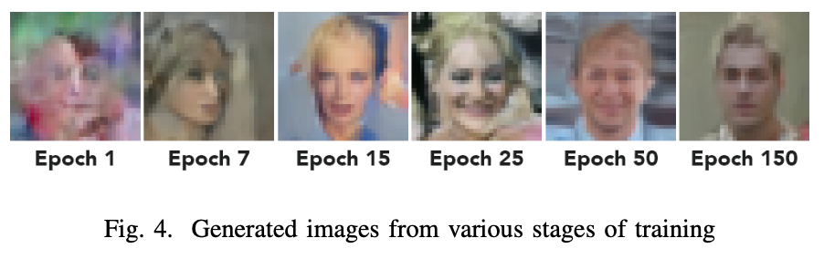
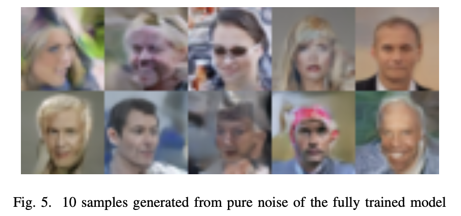
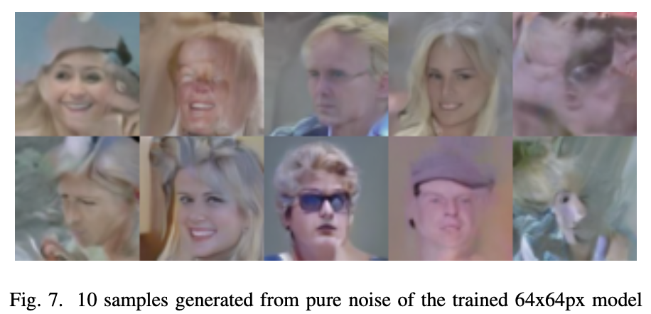

# Denoising Diffusion Model for Face Generation

This repository contains the codebase for training a denoising diffusion probabilistic model to generate face images from pure noise. Our approach effectively scales the training process to be feasible on a personal computer. We've achieved reasonable fidelity for 32x32 and 64x64 image outputs, using the CelebA [5] dataset. This repository also offers a detailed analysis of the architecture and training process of the model, with validations for its mechanisms.

## Results

Our model was able to produce face images of reasonable fidelity for 32x32 and 64x64 image outputs.

The training process for 32x32px looks like this:

And the results for 32x32px:

For 64x64px, the results after 66 epochs look like this. We ran out of cloud credits to train it further, but the results are still quite good.

For more information about the results and the architecture of the model and the project itself, check out our [technical report](./docs/SSY340_DML_project_report.pdf).

## References

1. CelebA Dataset: [link](http://mmlab.ie.cuhk.edu.hk/projects/CelebA.html)

---

**NOTE**

This project was developed as a final project for the DIT968 Deep Machine Learning course at Chalmers.
